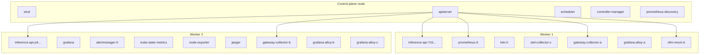
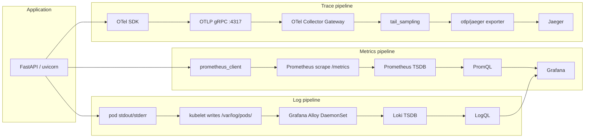
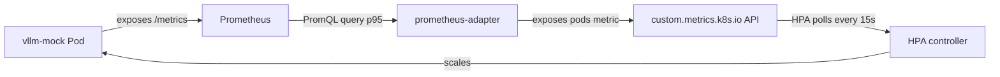
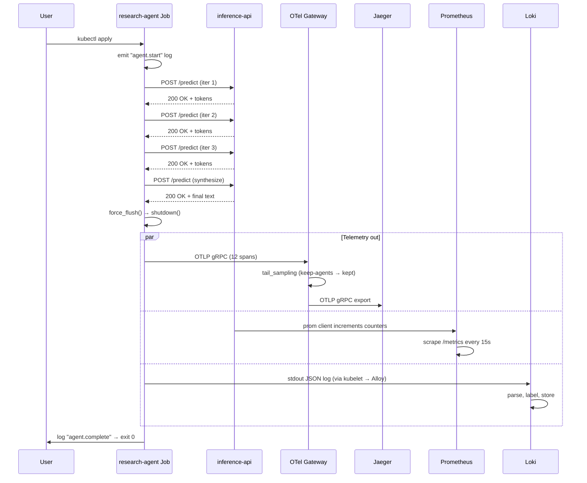

# Architecture — Day-23 K8s Observability + AI/Agent Stack

## Cluster topology

## Telemetry flow — three signals, three paths

## Autoscaling — custom metric path

## Sampling policy in OTel Gateway

The gateway's `tail_sampling` keeps:
1. ALL traces with status ERROR (`keep-errors`)
2. ALL traces with latency > 2s (`keep-slow`)
3. ALL traces from `research-agent` / `research-agent-cron` (`keep-agents`)
4. 1% of everything else (`probabilistic-1pct`)

For an agent run that succeeds in ~3 seconds with no errors, only
the explicit `keep-agents` policy saves it from the 1% cull. This
is intentional — agent traces are usually short and uneventful, but
still expensive to drop when investigating.

## Request flow — a single agent run

